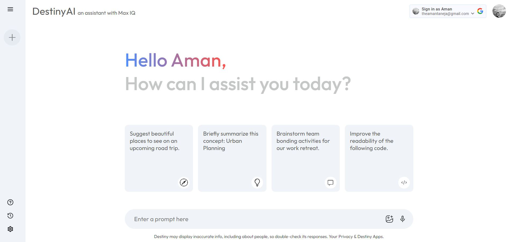
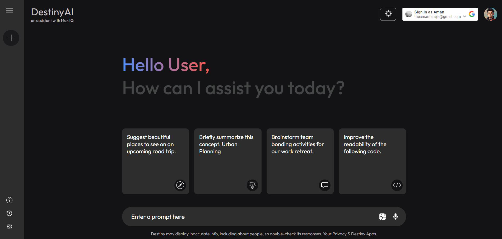

# DestinyAI - A MaxIQ Product

Welcome to DestinyAI, a MaxIQ product founded by Aman Taneja. DestinyAI is an artificial intelligence-powered investment assistant designed to empower investors with intelligent insights and personalized guidance. With an intuitive chat interface and a vision for the future, DestinyAI is poised to redefine the landscape of financial decision-making.

## Features

### 1. Intelligent Chat Interface
Engage in natural and insightful conversations with DestinyAI through our cutting-edge chat interface. Whether you're a novice investor or an experienced trader, DestinyAI adapts to your needs, providing tailored advice and analysis in real-time.

### 2. Sign-in and Sign-out
Effortlessly access your DestinyAI account with our seamless sign-in and sign-out functionality. Your investment journey begins with a simple authentication process, ensuring privacy and security every step of the way.

### 3. Dynamic Drop-down Menu
Navigate DestinyAI with ease using our dynamic drop-down menu. Access key features, settings, and resources with intuitive simplicity, enhancing your user experience and efficiency.

### 4. Intelligent Insights
Leverage DestinyAI's advanced artificial intelligence algorithms to gain valuable insights into market trends, asset performance, and investment opportunities. From risk assessment to portfolio optimization, DestinyAI empowers you with the knowledge to make informed decisions.

### 5. Dark Mode
Experience DestinyAI in a whole new light with our newly added Dark Mode feature. Switch seamlessly between light and dark themes to suit your preference and reduce eye strain during late-night investment sessions.

## User Interface
  

## Dark Mode

## Future Plans

DestinyAI is committed to continuous innovation and improvement. Our future plans include:

- **Enhanced Data Visualization:** Introduce interactive charts and graphs to visualize investment trends and analysis, providing a richer and more immersive user experience.
- **Natural Language Processing:** Further enhance DestinyAI's natural language processing capabilities to understand and respond to complex user queries with greater accuracy and depth.
- **Personalized Recommendations:** Develop personalized investment recommendations based on user preferences, risk tolerance, and financial goals, delivering actionable insights tailored to individual needs.

## Getting Started

To begin your journey with DestinyAI, simply clone the repository and follow the setup instructions in the [documentation](docs/README.md). Dive into the world of intelligent investing and discover the potential of artificial intelligence in shaping your financial future.

## Feedback and Contributions

We value your feedback and contributions to DestinyAI. Whether you have suggestions for improvement, bug reports, or ideas for new features, we encourage you to join our community and contribute to the evolution of DestinyAI.

## Contact Us

For inquiries, support, or partnership opportunities, please contact us at [theamantaneja@gmail.com](mailto:theamantaneja@gmail.com).

Let DestinyAI guide you towards smarter investments and financial success.
